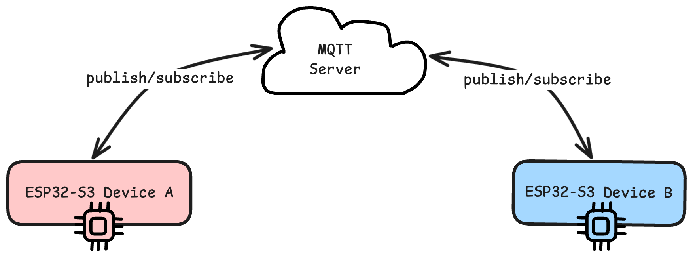
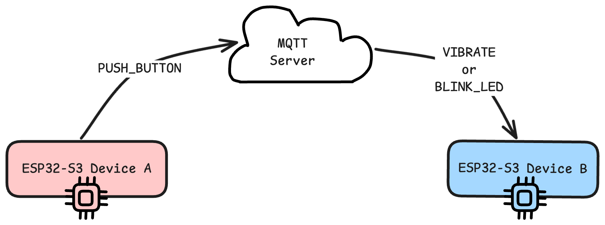
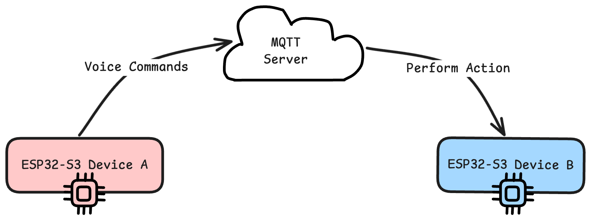

# Ember ❤️ Physical Heartbeat

*A tangible connection for loved ones, providing presence and peace of mind through ambient haptics and accessible voice commands.*

**Developed for the NiT Sparkathon (October 2025)**

---

## 🚀 The Problem

In an increasingly digital world, meaningful connection with our elderly loved ones can feel difficult. Phone calls can be intrusive, text messages can be hard to read, and video chats require technical comfort. This often leaves a gap—a desire to share a simple, silent moment of presence that says, "I'm thinking of you," without demanding an immediate response. Furthermore, how can we provide an accessible layer of safety that respects their independence?

## ✨ Our Solution: CarePulse

CarePulse is a two-device system designed to bridge this emotional and physical distance. It creates a dedicated, non-intrusive channel for connection and provides an easy-to-use safety net for elderly individuals living alone.

It consists of two paired devices:

1.  **The Sender (The "Heart"):** A simple, elegant device for a family member or friend. A single tap sends a gentle, silent "heartbeat" pulse across the internet to their loved one.
2.  **The Receiver (The "Companion"):** This device, for the elderly user, receives the haptic pulse. More importantly, it listens for simple, offline voice commands to send acknowledgements or an urgent "Help" alert, all without needing to find a phone or press a small button.

---

## 🌟 Key Features

* **❤️ Ambient Heartbeat:** Tap the Sender device to send a single, gentle haptic pulse to the Companion, a silent and comforting way to show you're thinking of them.
* **🗣️ Offline Voice Commands:** The Companion device uses an embedded, offline speech recognition model (built with Edge Impulse) to ensure privacy, low latency, and functionality without an internet connection for core commands.
* **🆘 Emergency "Help" Alert:** A simple voice command like "Help" or "SOS" instantly sends an alert to the Sender device, which responds with a distinct visual and haptic pattern.
* **🤫 Physical Do-Not-Disturb (DND):** A physical slide switch on the Companion allows the user to easily pause all incoming pulses, ensuring their space and privacy are respected.
* **✅ Simple Acknowledgements:** Commands like "I'm okay" or "Good morning" send a gentle confirmation back to the Sender, providing peace of mind.
* **🌐 Real-time Communication:** Utilizes the lightweight MQTT protocol for ultra-low latency communication between the devices over WiFi.

---

## 🛠️ Technology Stack & Hardware

### Hardware Components
* **Microcontroller:** 2 x Seeed Studio XIAO ESP32-S3 (with built-in microphone)
* **Haptic Feedback:** 2 x Vibration Motors (ERM)
* **Input:**
    * 1 x Pushbutton (for the Sender)
    * 1 x Slide Switch (for the Companion's DND)
    * Onboard PDM Digital Microphone (for the Companion)

### Software, Firmware & Cloud
* **Firmware:** Arduino / C++
* **Communication Protocol:** MQTT (using a public broker like HiveMQ for the prototype)
* **Libraries:** `ArduinoJson`, `PubSubClient`, and a custom Edge Impulse inference library.

### System Architecture
  

---

## ⚙️ Getting Started & Replication

To replicate this project, you will need the hardware listed above.

1.  **Hardware Assembly:** Wire the components according to the schematics (or Wokwi simulation diagrams).
2.  **Software Setup:**
    * Install the Arduino IDE and the board support package for the XIAO ESP32-S3.
    * Install the required libraries: `PubSubClient`, `ArduinoJson`.
3.  **Train Voice Model:**
    * Create a free account on Edge Impulse.
    * Collect samples of your command words ("Help", "Okay", "Call me") and background noise.
    * Train a classification model and deploy it as an Arduino library. Install the `.zip` library in your IDE.
4.  **Configuration:**
    * Ensure both devices are pointing to the same MQTT broker and topics.
5.  **Flash Firmware:** Upload the compiled code to each of the XIAO ESP32-S3 boards.

---

## 🔮 Future Scope

This prototype lays the foundation for many potential improvements:
* **Companion App:** A mobile app for family members to see status history, receive notifications, and send custom pulses.
* **Medication & Appointment Reminders:** The Companion device could provide haptic and LED reminders, with the user confirming via a voice command.
* **Custom Enclosures:** Design and 3D print beautiful, non-clinical enclosures for the devices.
* **Long-Range Communication:** Explore LoRa for communication in areas with unreliable WiFi.
* **Rechargeable Battery:** Integrate LiPo batteries and charging circuits for portability.

---

## 🏆 Project Status

This project is a functional prototype created in under 48 hours for the **NiT Sparkathon**. It successfully demonstrates the core concepts of ambient connection and accessible voice-based safety alerts.

---

## 👥 Authors

* [Yash Prajapati](https://github.com/thatbackendguy)
* [Jayesh Sawant](https://github.com/j23saw)
* [Ashutosh Chatterjee](https://github.com/Reaper2403)
* [Sargunpreet Kaur](https://github.com/sargun07)
* Stella Lo